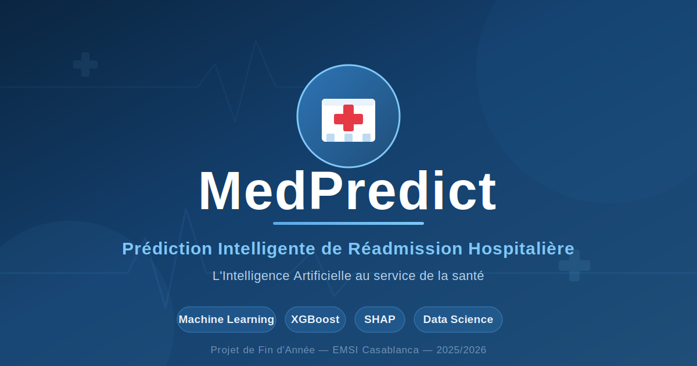
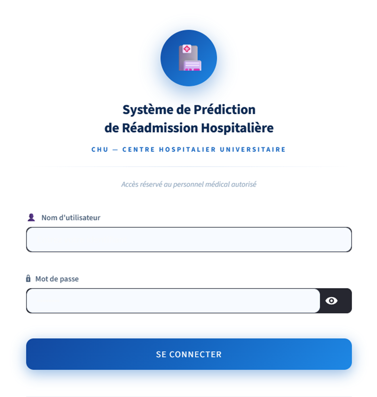
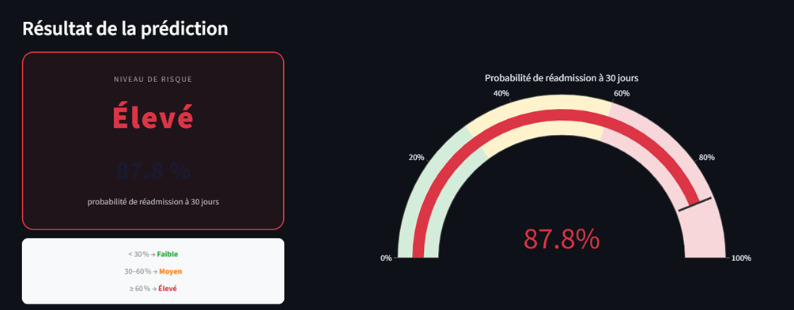
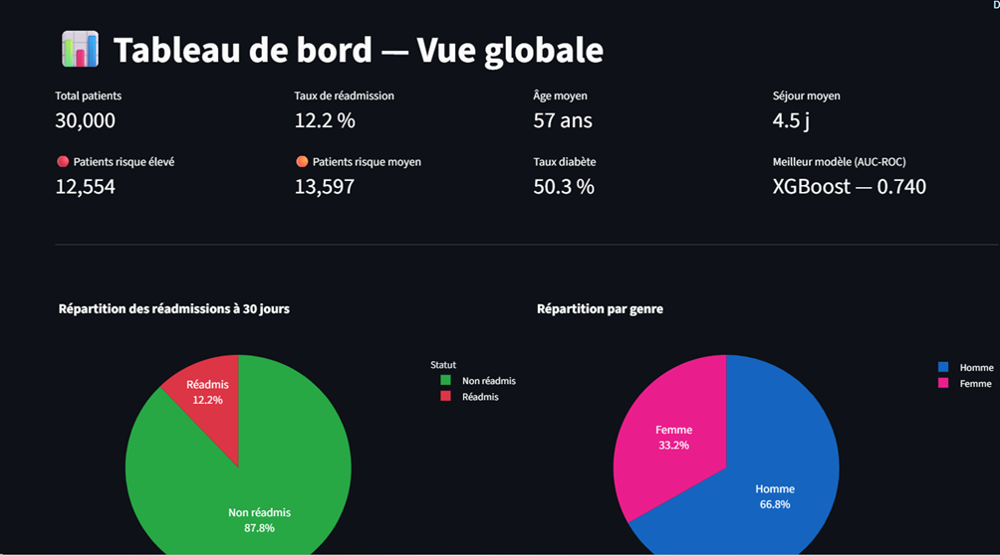

<div align="center">



# 🏥 MedPredict

### Système Intelligent de Prédiction de Réadmission Hospitalière à 30 Jours

*L'Intelligence Artificielle au service de la santé*

[](https://www.python.org/)
[](https://xgboost.readthedocs.io/)
[](https://fastapi.tiangolo.com/)
[](https://streamlit.io/)
[](https://www.docker.com/)
[](LICENSE)

</div>

---

## 📖 À propos du projet

**MedPredict** est un système complet de prédiction de réadmission hospitalière à 30 jours, développé dans le cadre d'un **Projet de Fin d'Année** en Intelligence Artificielle & Data Science à l'**EMSI Casablanca** (2025-2026).

La réadmission hospitalière non planifiée touche 12 à 25 % des patients et représente un défi médical et économique majeur. MedPredict aide les médecins à **identifier les patients à risque dès leur sortie**, afin de mieux les accompagner et de réduire les réadmissions évitables.

Le système couvre l'ensemble de la chaîne Data Science : de l'analyse exploratoire des données jusqu'au déploiement d'une application web interactive, en passant par la modélisation, l'explicabilité et la containerisation.

---

## ✨ Fonctionnalités principales

- 🎯 **Prédiction du risque** de réadmission en temps réel (niveau Faible / Moyen / Élevé)
- 🔍 **Explicabilité SHAP** : chaque prédiction est transparente, jamais une « boîte noire »
- 👨‍⚕️ **Espace Médecin** : gestion des patients, recherche, fiche clinique, prédiction
- 📊 **Espace Administrateur** : tableau de bord, comparaison des modèles, exploration des données
- 🔐 **Authentification** différenciée par rôle (Médecin / Administrateur)
- 🚀 **API REST** documentée automatiquement (Swagger)
- 🐳 **Déploiement Docker** en une seule commande

---

## 🛠️ Stack Technique

| Catégorie | Technologies |
|-----------|-------------|
| **Langage** | Python 3.13 |
| **Machine Learning** | XGBoost, scikit-learn, imbalanced-learn (SMOTE) |
| **Explicabilité** | SHAP |
| **Tracking ML** | MLflow |
| **API Backend** | FastAPI, Uvicorn |
| **Interface** | Streamlit, Plotly |
| **Containerisation** | Docker, Docker Compose |
| **Données** | Pandas, NumPy |

---

## 📈 Résultats

Trois modèles ont été entraînés et comparés via MLflow. **XGBoost** a été sélectionné comme meilleur modèle :

| Modèle | AUC-ROC | Recall | F1-Score | Précision |
|--------|:-------:|:------:|:--------:|:---------:|
| Régression Logistique | 0.56 | 0.22 | 0.17 | 0.15 |
| Random Forest | 0.55 | 0.25 | 0.18 | 0.14 |
| **XGBoost** ✅ | **0.74** | **0.79** | **0.46** | **0.32** |

> 💡 En médecine, le **Recall** est prioritaire : il vaut mieux détecter trop de patients à risque que d'en manquer un seul.

---

## 🖼️ Aperçu de l'application

<div align="center">

### Page de connexion


### Explication SHAP — Contribution de chaque variable


### Tableau de bord Administrateur


</div>

> 📌 *Placez vos captures d'écran dans un dossier `assets/` à la racine du projet et nommez-les comme ci-dessus.*

---

## 🚀 Installation et Lancement

### Prérequis
- [Docker](https://www.docker.com/) et Docker Compose installés

### Lancement avec Docker (recommandé)

```bash
# Cloner le dépôt
git clone https://github.com/salmachah/MedPredict.git
cd MedPredict

# Lancer tous les services
docker-compose up --build
```

L'application sera accessible sur :
- 🖥️ **Dashboard Streamlit** : http://localhost:8501
- 🔌 **API FastAPI (Swagger)** : http://localhost:8000/docs
- 📊 **MLflow** : http://localhost:5000

### Lancement manuel (sans Docker)

```bash
# Installer les dépendances
pip install -r requirements.txt

# Lancer l'API
uvicorn api.main:app --reload

# Dans un autre terminal, lancer le dashboard
streamlit run dashboard/app.py
```

### Identifiants de démonstration

| Rôle | Identifiant | Mot de passe |
|------|-------------|--------------|
| Médecin | `medecin` | `medecin123` |
| Administrateur | `admin` | `admin123` |

---

## 📂 Structure du projet

```
MedPredict/
├── api/                  # API REST FastAPI
│   └── main.py
├── dashboard/            # Interface Streamlit
│   └── app.py
├── data/                 # Dataset et scripts de données
├── models/               # Modèles entraînés (.pkl)
├── notebooks/            # Analyse exploratoire (EDA)
├── src/                  # Pipeline de preprocessing et ML
├── assets/               # Images et captures d'écran
├── docker-compose.yml    # Orchestration des services
├── requirements.txt      # Dépendances Python
└── README.md
```

---

## 🔬 Méthodologie

Le projet suit le framework **CRISP-DM** :

1. **Compréhension métier** — étude du domaine médical
2. **Compréhension des données** — analyse exploratoire de 30 000 patients
3. **Préparation des données** — pipeline de preprocessing en 7 étapes + feature engineering + SMOTE
4. **Modélisation** — entraînement et comparaison de 3 modèles
5. **Évaluation** — validation sur test set réel + analyse SHAP
6. **Déploiement** — API, dashboard et containerisation Docker

> ⚠️ Le SMOTE est appliqué **uniquement sur les données d'entraînement** afin d'éviter tout *data leakage*.

---

## 👥 Équipe

Ce projet a été réalisé par :

- **Salma Chah**
- **Aya Laik**
- **Wissal Lamris**

**Encadrant :** M. Abdelali Zakrani

*Filière Intelligence Artificielle et Data Science — EMSI Casablanca — 2025/2026*

---

## 📄 Licence

Ce projet est distribué sous licence MIT. Voir le fichier [LICENSE](LICENSE) pour plus de détails.

---

<div align="center">

⭐ **Si ce projet vous a plu, n'hésitez pas à lui donner une étoile !** ⭐

</div>
